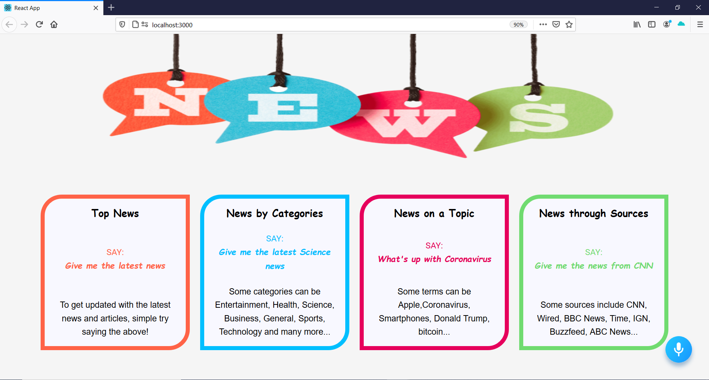

# News Reading App with Voice Recognition

This React app is built using ALAN AI Voice-recognition bot. In the news application, we can easily command the bot to open up latest news or articles according to category or  different topics. We can also command the bot to read us the headlines and open up specific article links. 

Reference:
https://www.youtube.com/watch?v=rqw3OftE5sA&list=PL6QREj8te1P6wX9m5KnicnDVEucbOPsqR&index=3

https://alan.app/

https://newsapi.org/
